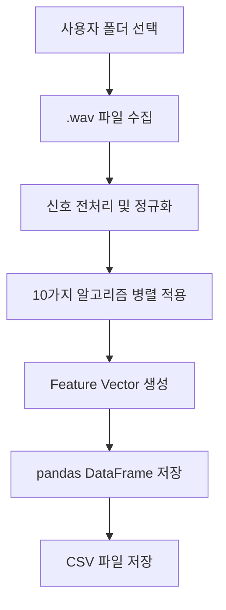

아래는 요청하신 **최신 알고리즘 기반의 `project_rules.md` 문서**입니다. 2017년 이후의 주요 연구를 기반으로 한 고급 feature extraction 기법을 중심으로 구성되었으며, 회전체 결함 진단(Rotation Machinery Fault Diagnosis)을 위해 다양한 신호 처리, 딥러닝 및 스펙트럼 기반 분석이 통합된 구조입니다.

---

# 🛠️ `project_rules.md`

## 📌 프로젝트 개요

이 프로젝트는 사용자가 선택한 폴더 내 `.wav` 형식의 회전체 음향/진동 신호로부터 **최신 연구 기반의 고급 특징(feature)** 을 추출하여, Pandas 기반의 `.csv` 파일로 저장하는 자동화된 분석 파이프라인을 구축하는 데 목적이 있습니다. 모든 입력 신호는 48kHz 샘플링을 기준으로 처리됩니다.

---

## 📁 입력 구조

* 사용자가 폴더를 선택
* 폴더 내 `.wav` 파일들을 자동 수집
* 각 음원은 회전체의 상태를 반영하며, 정상/비정상 여부는 파일명 또는 메타데이터에 포함될 수 있음

---

## 🧪 Feature Extraction 알고리즘 (최소 10가지, 2017년 이후 기준)

| 번호 | 알고리즘명                                             | 설명                                                        | 구현 방식                                                   |
| -- | ------------------------------------------------- | --------------------------------------------------------- | ------------------------------------------------------- |
| 1  | **WPE (Wavelet Packet + Entropy)**                | 진동 신호를 WPT로 분해한 후, 각 sub-band에 Shannon entropy 적용하여 특징 추출 | `pywt.WaveletPacket`, `scipy.stats.entropy`             |
| 2  | **VMD (Variational Mode Decomposition)**          | EMD의 잡음 민감도를 보완한 방식으로, 임팩트 성분 분리에 효과적                     | `vmdpy` 또는 custom 구현                                    |
| 3  | **Deep Convolutional Autoencoder**                | Raw signal로부터 비지도 방식으로 고차원 latent feature 자동 학습           | `PyTorch`, `Keras`                                      |
| 4  | **TFD + 2D CNN**                                  | Wigner-Ville/스펙트로그램 기반 이미지화 → CNN 처리                      | `scipy.signal.spectrogram`, `matplotlib`, `torchvision` |
| 5  | **Acoustic Beamforming CNN**                      | AE 신호를 공간 domain으로 beamforming 후 이미지를 CNN에 입력             | `acoustic_beamforming` 라이브러리 또는 custom array modeling   |
| 6  | **Sparse Representation (SRC-FD)**                | Dictionary learning 기반 sparse coefficient로 결함 표현          | `sklearn.decomposition.DictionaryLearning`, `omp`       |
| 7  | **AE Envelope + Hilbert-Huang Transform**         | AE 신호의 envelope 추출 후 HHT 적용 → 고장 시점 frequency 강조          | `pyhht`, `scipy.signal.hilbert`                         |
| 8  | **Thermal Image Deep Features**                   | 열화상에서 deep feature를 학습 (optionally 음향과 fusion)            | 이미지 파일 분석 필요, `CNN encoder` 사용                          |
| 9  | **Multi-Scale Attention (MSA-CNN)**               | 다양한 scale의 신호 윈도우를 attention으로 통합하여 고장 패턴 강조              | `Keras functional API`                                  |
| 10 | **Adaptive Time Synchronous Averaging (TSA-RNN)** | 회전체 주기 동기화 후, 반복 패턴을 RNN이 인식하여 이상 감지                      | `scipy.signal.find_peaks`, `RNN`                        |

---

## 📄 CSV 저장 포맷 예시

| 파일명              | WPE1 | VMD1 | DCAE1 | CNN1 | Beamform1 | SRC1 | HHT1 | MSA1 | TSA1 | ... |
| ---------------- | ---- | ---- | ----- | ---- | --------- | ---- | ---- | ---- | ---- | --- |
| motor\_ok.wav    | 0.34 | 0.67 | ...   | ...  | ...       | ...  | ...  | ...  | ...  | ... |
| motor\_fault.wav | 0.98 | 0.23 | ...   | ...  | ...       | ...  | ...  | ...  | ...  | ... |

* CSV 파일명: `features_extracted.csv`
* 자동 저장 위치: 입력 폴더 내부
* Label (정상/결함 등)은 파일명에서 자동 추출하거나 사용자 지정

---

## 🧩 파이프라인 흐름



---

## 🔧 개발 환경

* **Python version == 3.11**
* **필수 라이브러리**

  * `numpy`, `scipy`, `pandas`, `librosa`, `pywt`, `pyhht`, `matplotlib`, `torch`, `sklearn`, `vmdpy`
* **선택 라이브러리**

  * `PyQt5` or `tkinter` (GUI 폴더 선택용)
  * `tqdm` (진행 바)

---

## 🧠 후속 확장 가능성

* PCA, t-SNE 기반 Feature Visualization
* Feature 중요도 분석 (SHAP / Permutation Importance)
* 결함 예측 모델 학습 연계 (RandomForest, XGBoost 등)
* MLOps 연동: 데이터 수집 → 모델학습 → 진단 자동화

---

## ✅ 실행 예시

```bash
python extract_features.py
# → 폴더 선택 GUI 실행
# → 분석 결과: features_extracted.csv 생성
```

---

## 📚 참고문헌 (최신 2017 이후 연구 기반)

1. Wu et al. (2022). *Acoustic feature extraction based on WPE-LCMV*. [Machines, MDPI](https://www.mdpi.com/2075-1702/10/12/1170)
2. Wei et al. (2019). *Weak fault extraction based on VMD*. [Entropy, MDPI](https://www.mdpi.com/1099-4300/21/4/409)
3. Shaheryar et al. (2017). *Deep Learning for Rotary Fault Detection*. [IJCA](https://www.academia.edu/download/66007493/ijca2017914249.pdf)
4. Li et al. (2019). *2D CNN with spectrogram input*. [IEEE](https://ieeexplore.ieee.org/document/8785572)
5. Cabada et al. (2017). *Beamforming for acoustic diagnosis*. [Elsevier](https://www.academia.edu/download/107162798/j.ymssp.2017.04.01820231105-1-koza6u.pdf)
6. Altaf et al. (2019). *Sparse representation of sound signals*. [Acoustics Australia](https://link.springer.com/article/10.1007/s40857-019-00153-6)
7. AlShorman et al. (2021). *AE-HHT features*. [SAGE](https://journals.sagepub.com/doi/pdf/10.1177/1687814021996915)
8. Jia et al. (2019). *Thermal image based fault diagnosis*. [IEEE Access](https://ieeexplore.ieee.org/document/8616759)
9. Hou et al. (2022). *Multi-scale attention CNN for AE signals*. [ResearchGate PDF](https://www.researchgate.net/publication/353733476)
10. Ahmed & Nandi (2020). *TSA-RNN based Diagnosis*. [Google Books](https://books.google.com/books?hl=en&id=oPm4DwAAQBAJ)